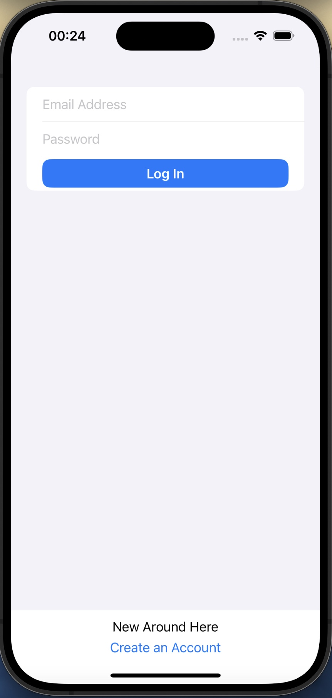
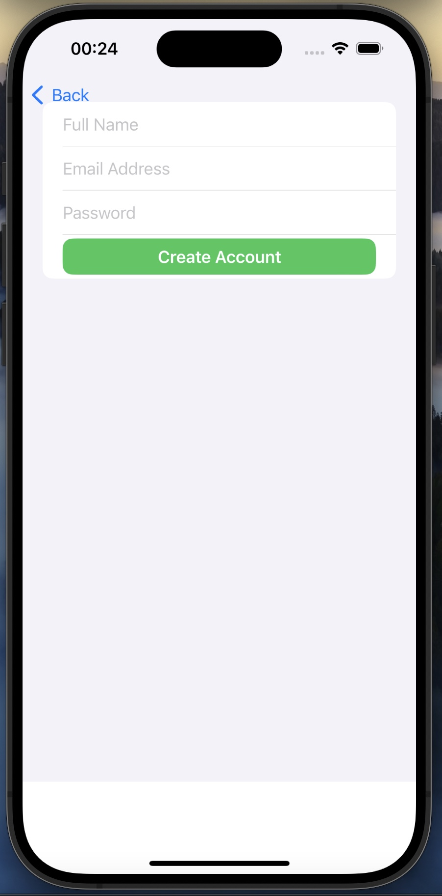
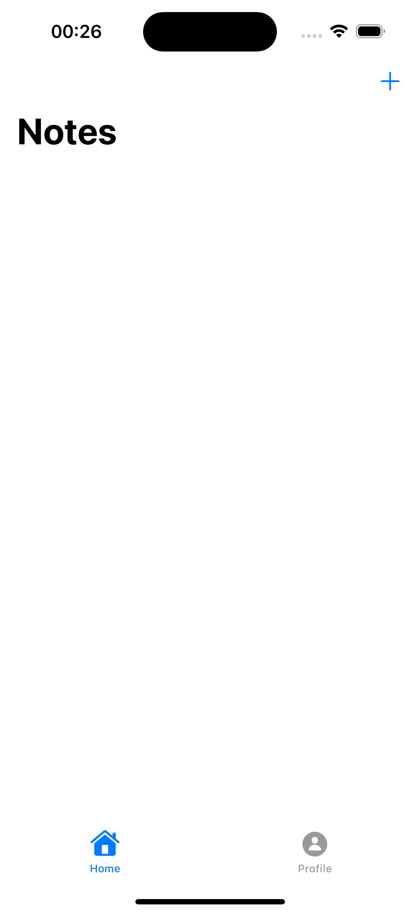
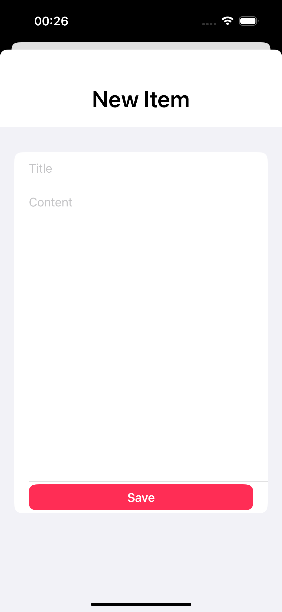
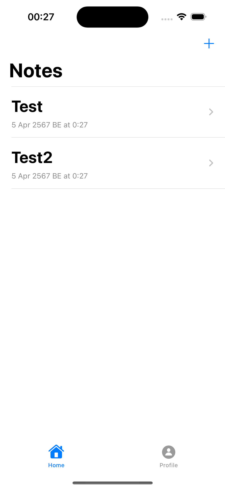
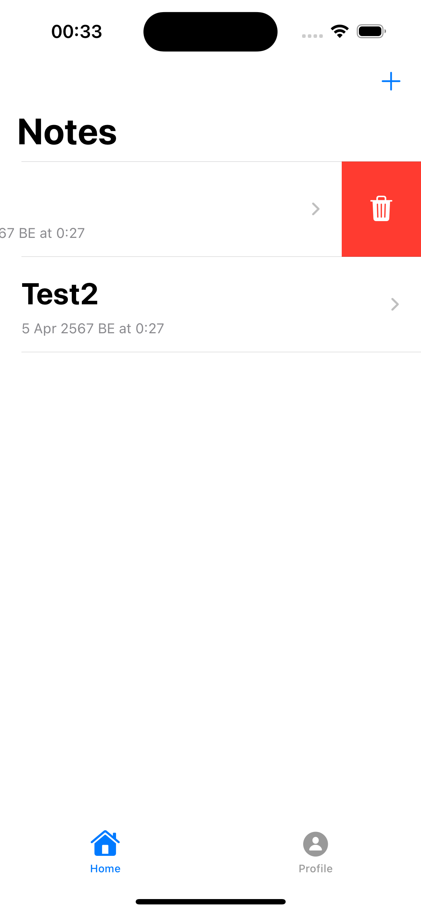
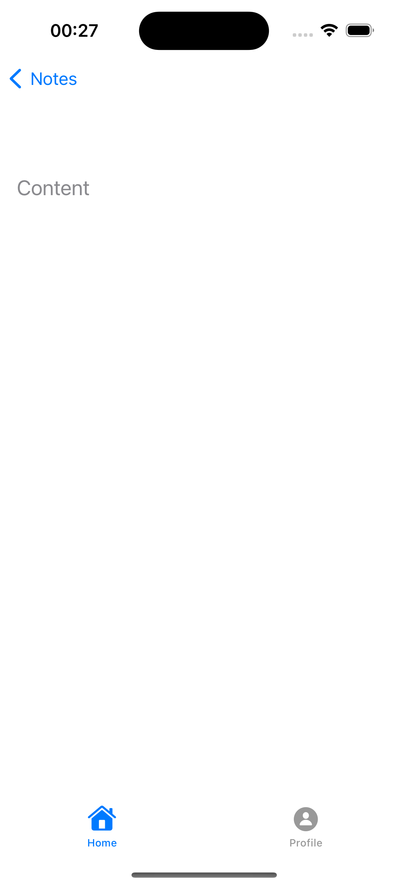
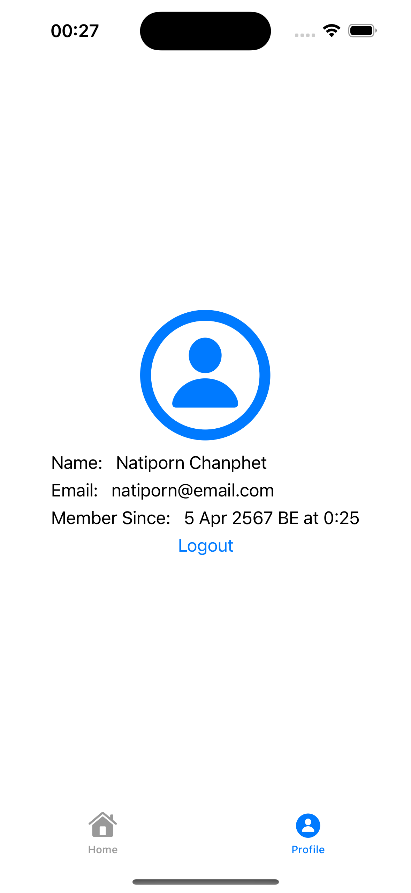

# CN436-AS4
6410615030 Natiphon Chanphet
[Demo Clip](https://youtu.be/kiQMgC7PDMs)

# Notes App

### How to use
* When you first open the app, you'll be prompted to either log in to your existing account or register a new account if you're a new user.
  

* Here's the register page. Enter Name , Email and Password.
  

* Once you're logged in, you'll be taken to the main screen of the app. To create a new note, tap on the "+" button. This will open a new note with fields for adding a title and content.
  

* All the notes you've created will now be visible in the list of notes on the main screen.

* To delete a note, swipe right on the note in the list. This will reveal a "Delete" button.
  Tap on the "Delete" button to remove the note from your list.

* To view the details of a specific note, simply tap on the note in the list. This will open the note in full-screen view, displaying the title and content.
 

* Here is your Profile page. You can view your profile details here, including your name, surname, and email address. To log out, simply tap on the logout button.
  

